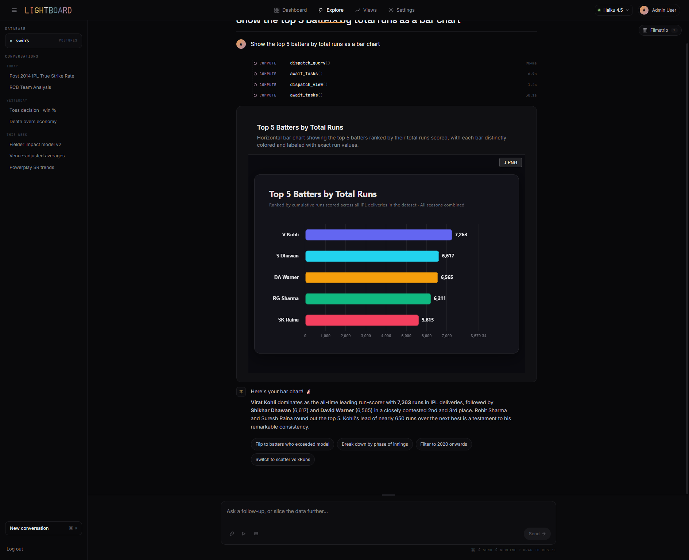
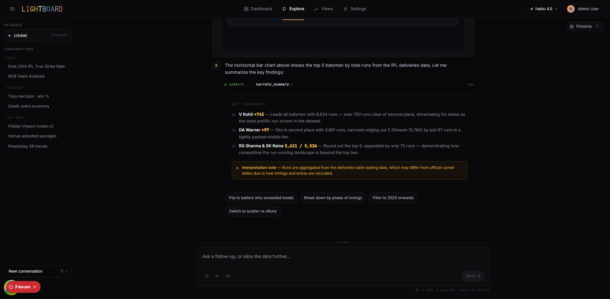
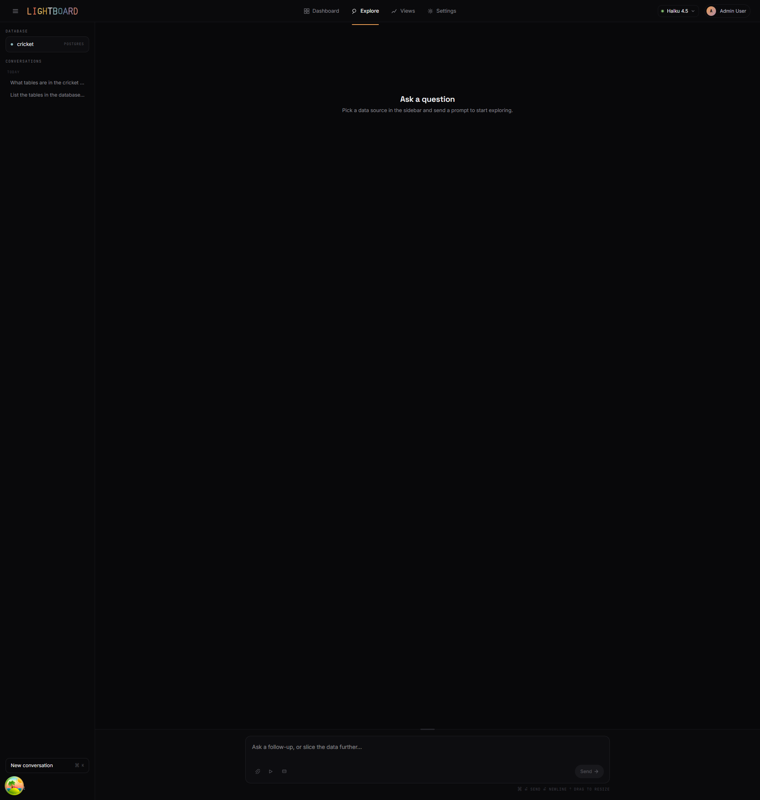
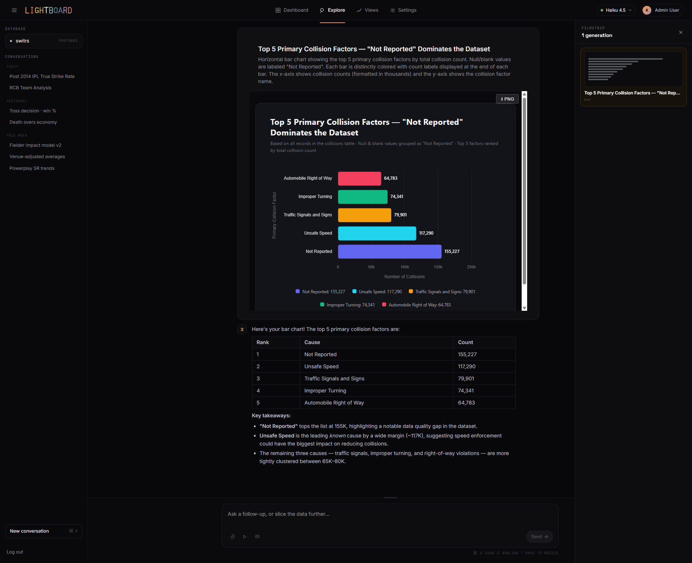

<p align="center">
  
</p>

<h1 align="center">Lightboard</h1>

<p align="center"><strong>Ask your data anything. Get answers that explain themselves.</strong></p>

<p align="center">
Lightboard turns a natural-language question into a branded, narrated visualization in seconds — and remembers the conversation so you can keep exploring. Connect a database, type a question, and a multi-agent system writes the SQL, designs the chart, and narrates what matters.
</p>

<p align="center">
  <video src="https://github.com/user-attachments/assets/f79ae2fd-3e6e-4188-96d7-3a52fe311061" alt="Exploring an IPL cricket dataset in Lightboard — the sidebar lists saved conversations, the main panel renders a multi-coloured bar chart of top teams by total runs with a magazine-style headline and subtitle, and a filmstrip chip at the top right counts generated views." />
</p>

## What it does

Pick a data source, ask a question, and Lightboard answers with a full editorial moment: a headline, a chart typeset like a magazine figure, a short narration of the takeaways, and a handful of follow-ups to keep the thread moving. Everything you generate in a session is one click away in the filmstrip, and every conversation is saved so you can come back to it tomorrow.

## Features

<table>
<tr>
<td width="50%" valign="top">
<br/>
<strong>Natural-language exploration</strong><br/>
Ask in English. Lightboard writes the SQL, runs it on your database, and renders an interactive chart — with follow-up chips queued up for your next question.
</td>
<td width="50%" valign="top">
<br/>
<strong>Narrated takeaways</strong><br/>
Every answer ships with plain-English insights — what matters, what to notice, and a few follow-up chips so the next question writes itself.
</td>
</tr>
<tr>
<td width="50%" valign="top">
<br/>
<strong>Saved conversations</strong><br/>
Pick up any thread from the sidebar. Schema context, follow-ups, and generated views all resume exactly where you left them.
</td>
<td width="50%" valign="top">
<br/>
<strong>Filmstrip of branded views</strong><br/>
Every chart you generate in a session stays one click away in the filmstrip — typeset in Space Grotesk, colored with an editorial warm-copper ramp, ready to pin.
</td>
</tr>
</table>

## Why Lightboard

- **AI-native by design.** A multi-agent system — a leader plus query, view, and insights specialists — writes the SQL, designs the chart, and narrates the finding. It is not a chatbot bolted onto a dashboard.
- **Opinionated visuals.** Every answer is typeset like a magazine figure — editorial headline, brand-aligned color ramp, narration below. No chart-config UI, no color-picker rabbit holes; the output *is* the config.
- **Bring your own model.** Works with Anthropic Claude or any OpenAI-compatible endpoint — cloud or local. Actively tuned against Claude Sonnet 4.6 and local Qwen 3.6 35b, so it runs equally well on the frontier or on a single workstation.
- **Pure TypeScript monorepo.** One `pnpm install` and you are running.

## Trust and transparency

Text-to-SQL tools fail in quiet, hard-to-spot ways — a wrong join, a fan-out double count, the right column read with the wrong semantics. Lightboard addresses this with mechanisms you can see and, increasingly, edit.

**Schema context you control.** When you connect a data source, Lightboard generates a first-pass schema context document — tables, columns, join paths, and the concepts they express. You refine it directly, or through conversation with an introspection agent. Every agent reads from this document on every question, so answers are grounded in how *your* data actually works, not how the model guessed it might. Our own working test corpus is a 20+-table ball-by-ball cricket dataset with dirty joins and unmatched free text; the grounding loop holds up on it, and on cleaner schemas it only gets easier.

**Visible SQL.** Every chart is rendered from a query you can inspect. The agent does not hide its working — if an answer looks wrong, the query is right there.

**Editable SQL (planned).** Query edits will round-trip into the conversation, directly or AI-assisted ("fix this join", "left-join and filter by season"). The agent will reconcile its understanding from your edit, so follow-up questions build on your version rather than its original.

## Planned features

- **Reusable visualizations.** Save any generated view and pull it — or a remix of it — into a later conversation without starting from a blank prompt.
- **Post-visualization data filtering.** Slice, bucket, and drill into a chart's underlying rows without round-tripping another prompt.
- **Composable dashboards.** Arrange saved views into a dashboard whose data refreshes automatically as the underlying source evolves.
- **Editable queries.** Direct or AI-assisted edits to generated SQL, reconciled into the agent's context for the rest of the conversation.

## Quick start

### Prerequisites

- Node.js >= 22
- pnpm 10.x (`corepack enable && corepack prepare pnpm@10.32.1 --activate`)
- Docker (for Postgres + Redis)

### Setup

```bash
# Clone and install
git clone https://github.com/vichitra-paheli/Lightboard.git
cd Lightboard
pnpm install

# Start Postgres and Redis
docker compose up -d

# Copy environment variables
cp .env.example apps/web/.env.local

# Apply database migrations
pnpm --filter @lightboard/db db:migrate

# Seed demo data (optional)
pnpm --filter @lightboard/db db:seed

# Start dev server
pnpm dev
```

Open [http://localhost:3000](http://localhost:3000) to see the app.

### Demo credentials

After running the seed script:

| Role | Email | Password |
|------|-------|----------|
| Admin | admin@lightboard.dev | lightboard123 |
| Viewer | viewer@lightboard.dev | lightboard123 |

## Architecture

Lightboard is a TypeScript monorepo built with Turborepo and pnpm workspaces. The web app is a Next.js 15 app-router application that talks to a multi-agent orchestration layer: a **leader** routes each question to one of three specialists — **query** (schema introspection and raw SQL), **view** (designs the chart and its editorial framing), or **insights** (stats and narration over an in-memory session scratchpad). Data sources plug in through a connector SDK.

```
lightboard/
├── apps/web/              # Next.js 15 app + Playwright E2E specs under e2e/
├── packages/
│   ├── agent/             # Multi-agent orchestration (leader + specialists)
│   ├── connector-sdk/     # Data source adapter interface (JSON rows)
│   ├── connectors/        # Postgres connector
│   ├── db/                # Drizzle schema, auth, migrations
│   └── ui/                # shadcn/ui component library
└── docker/                # Docker Compose for local dev
```

### Tech stack

| Layer | Technology |
|-------|-----------|
| Framework | Next.js 15 (app router, Turbopack) |
| UI | shadcn/ui + Tailwind CSS v4 (dark-only, design-system tokens) |
| Typography | Space Grotesk · Inter · JetBrains Mono |
| State | Zustand (client), @tanstack/react-query (server) |
| ORM | Drizzle ORM + PostgreSQL |
| Cache | Redis (ioredis) |
| Auth | Session-based (Argon2 + oslo) |
| Testing | Vitest + Playwright + Testing Library |

## Development

```bash
pnpm dev          # Start dev server (Turbopack)
pnpm build        # Production build
pnpm test         # Unit tests (Vitest)
pnpm test:e2e     # E2E tests (Playwright)
pnpm typecheck    # TypeScript type checking
pnpm lint         # ESLint + Prettier
pnpm format       # Auto-format all files
```

### Per-package commands

```bash
pnpm --filter @lightboard/web dev            # Web app only
pnpm --filter @lightboard/db db:migrate      # Apply pending migrations
pnpm --filter @lightboard/db db:bootstrap    # Backfill tracking for DBs seeded by the old db:push flow
pnpm --filter @lightboard/db db:generate     # Generate migration from schema changes
pnpm --filter @lightboard/db db:seed         # Seed demo data
pnpm --filter @lightboard/db db:studio       # Open Drizzle Studio
```

## Contributing

1. Create a feature branch from `main` (`feat/`, `fix/`, `refactor/`).
2. Follow the code standards in `CLAUDE.md`.
3. Ensure CI passes (lint, typecheck, unit tests, E2E tests).
4. Open a PR — squash merge into `main`.
